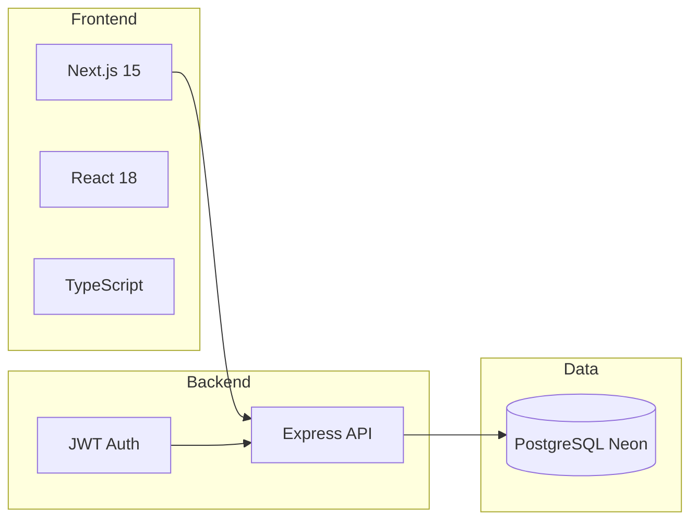

# QuickBite Architecture

High-level overview of the stack and deployment.

## Stack

- **Frontend:** Next.js 15 (App Router), React 18, TypeScript. Uses `NEXT_PUBLIC_API_URL` to call the backend. Auth state and token live in React context and localStorage.
- **Backend:** Express on Node.js. Routes: `/api/auth`, `/api/restaurants`, `/api/orders`, `/api/users`, `/api/cart`, `/api/health`, `/api/search`. JWT for protected routes; bcrypt for passwords; CORS and rate limiting enabled.
- **Database:** PostgreSQL on Neon. Schema and seed live in `server/migrations/` and `server/seed.js`. Connection via `DATABASE_URL`.

## Data Flow

- **Restaurants:** Frontend calls `GET /api/restaurants` or `GET /api/restaurants/:id`. `restaurant-service.ts` uses the API and falls back to static data from `data.ts` if the API fails.
- **Search:** Home page sends `POST /api/search` with a query; backend returns matching restaurants.
- **Auth:** Register/login hit `/api/auth/register` and `/api/auth/login`; backend returns JWT and user; frontend stores token and user in context and localStorage.
- **Orders:** Checkout sends `POST /api/orders` with restaurant id, items, total, delivery address/notes; backend writes to `orders` table. Orders page uses `GET /api/orders`.

## Deployment

- **Frontend:** Vercel. Build command: `next build`. Env: `NEXT_PUBLIC_API_URL` set to the production backend URL (e.g. Render).
- **Backend:** Render (or similar). Start: `node src/index.js`. Env: `DATABASE_URL` (Neon), `JWT_SECRET`, `CORS_ORIGIN` (include Vercel app URL), `NODE_ENV=production`.
- **Database:** Neon PostgreSQL. Run migrations (`node run_migration.js`) and optionally seed (`node seed.js`) against the production DB before or after first deploy.

## Key Files

| Role | Location |
|------|----------|
| API client | `src/config/api.ts` |
| Restaurant fetch + fallback | `src/lib/restaurant-service.ts` |
| Auth state | `src/context/AuthContext.tsx` |
| Cart state | `src/hooks/useCart.tsx` |
| Backend entry | `server/src/index.js` |
| DB connection | `server/src/db.js` |
| Migrations | `server/migrations/*.sql` |
| Seed | `server/seed.js` |
